# Jira Analyzer Memory Bank Index

## Project Overview

Jira Analyzer is a specialized analytics tool that extracts, processes, and visualizes workflow metrics from Jira to help teams gain insights into their development processes. It bridges the gap between raw Jira data and actionable team insights by providing customizable workflow analysis, intuitive visualizations, and reusable configurations.

## Start Here

**New to the project?** Follow this sequence to get up to speed quickly:

1. Read [Project Brief](./projectbrief.md) for core requirements and scope
2. Review [Product Context](./productContext.md) to understand why this project exists
3. Check [Active Context](./activeContext.md) for current work focus
4. Explore [System Patterns](./systemPatterns.md) and [Tech Context](./techContext.md) for technical details

**Returning developer?** Start with:

1. [Active Context](./activeContext.md) for recent changes and current focus
2. [Progress](./progress.md) for project status updates

**AI Assistant (Cline)?** Start with:

1. [Cline Operating Instructions](./CLINE_OPERATING_INSTRUCTIONS.md) for complete operating protocol
2. [Custom Rule](./CUSTOM_RULE.md) for simplified custom rule reference

## Frequently Referenced

- [Custom Hook Patterns](./code-patterns/custom-hook-patterns.md) - React hook implementation patterns
- [SOLID Principles](./patterns/solid.md) - How SOLID is implemented in the project
- [Unit Testing](./testing/unit-testing.md) - Testing standards and practices
- [Memory Bank Updates](./maintenance/memory-bank-updates.md) - When and how to update documentation
- [Configuration Management](./features/configuration-management.md) - How configurations are managed
- [CI/CD Pipeline](./deployment/ci-cd-pipeline.md) - Continuous integration and deployment
- [Cline Operating Instructions](./CLINE_OPERATING_INSTRUCTIONS.md) - How Cline AI assistant operates with the codebase

## Recently Updated Documents

The following documents have been recently updated with executive summaries and quick reference guides:

| Category          | Documents                                                                                                                                                                                                             |
| ----------------- | --------------------------------------------------------------------------------------------------------------------------------------------------------------------------------------------------------------------- |
| **Features**          | [Configuration Management](./features/configuration-management.md), [Metrics Visualization](./features/metrics-visualization.md), [Readme](./features/README.md), [Workflow Editor](./features/workflow-editor.md), [Jql Builder](./features/jql-builder.md) |
| **API**          | [Readme](./api/README.md), [Jira Integration](./api/jira-integration.md), [Backend Api](./api/backend-api.md), [Error Handling](./api/error-handling.md), [Workflow](./api/schemas/workflow.md), [Configurations](./api/schemas/configurations.md), [Metrics](./api/schemas/metrics.md) |
## Documentation Map

This index provides a comprehensive guide to all documentation in the Jira Analyzer Memory Bank. Use this as your starting point to navigate the project documentation.

```mermaid
graph TD
    INDEX[INDEX.md] --> CORE[Core Documentation]
    INDEX --> FEATURES[Feature Documentation]
    INDEX --> API[API Documentation]
    INDEX --> PATTERNS[Design Patterns]
    INDEX --> TESTING[Testing Documentation]
    INDEX --> DEPLOYMENT[Deployment Documentation]
    INDEX --> INTEGRATIONS[Integration Documentation]

    CORE --> PB[projectbrief.md]
    CORE --> PC[productContext.md]
    CORE --> SP[systemPatterns.md]
    CORE --> TC[techContext.md]
    CORE --> AC[activeContext.md]
    CORE --> PR[progress.md]
    CORE --> COI[CLINE_OPERATING_INSTRUCTIONS.md]
    CORE --> CR[CUSTOM_RULE.md]

    PATTERNS --> SOLID[patterns/solid.md]
    PATTERNS --> CQRS[patterns/cqrs.md]
    PATTERNS --> FP[patterns/functional-programming.md]

    TESTING --> UNIT[testing/unit-testing.md]
    TESTING --> INT[testing/integration-testing.md]
    TESTING --> E2E[testing/e2e-testing.md]
    TESTING --> PERF[testing/performance-testing.md]
    TESTING --> DATA[testing/test-data.md]

    FEATURES --> CONFIG[features/configuration-management.md]
    FEATURES --> JQL[features/jql-builder.md]
    FEATURES --> METRICS[features/metrics-visualization.md]
    FEATURES --> WORKFLOW[features/workflow-editor.md]

    API --> BACKEND[api/backend-api.md]
    API --> ERRORS[api/error-handling.md]
    API --> JIRA[api/jira-integration.md]
    API --> SCHEMAS[api/schemas/]

    DEPLOYMENT --> CICD[deployment/ci-cd-pipeline.md]
    DEPLOYMENT --> DOCKER[deployment/docker-deployment.md]
    DEPLOYMENT --> ENV[deployment/environments.md]
    DEPLOYMENT --> MONITOR[deployment/monitoring.md]

    INTEGRATIONS --> AUTH[integrations/authentication.md]
    INTEGRATIONS --> CLOUD[integrations/jira-cloud.md]
    INTEGRATIONS --> SERVER[integrations/jira-server.md]
```



## Core Documentation

| Document                                                          | Description                                       | Key Sections                                                              |
| ----------------------------------------------------------------- | ------------------------------------------------- | ------------------------------------------------------------------------- |
| [Project Brief](./projectbrief.md)                                | Foundation document defining core requirements    | Project Definition, Core Requirements, Project Scope                      |
| [Product Context](./productContext.md)                            | Why this project exists and problems it solves    | Problem Statement, User Personas, User Journeys                           |
| [System Patterns](./systemPatterns.md)                            | System architecture and key technical decisions   | SOLID Implementation, CQRS Implementation, Design Patterns                |
| [Tech Context](./techContext.md)                                  | Technologies used and development setup           | Tech Stack, Development Setup, Technical Constraints                      |
| [Active Context](./activeContext.md)                              | Current work focus and recent changes             | Current Focus, Recent Changes, Next Steps                                 |
| [Progress](./progress.md)                                         | Project status and evolution of decisions         | What Works, What's Left, Current Status, Evolution                        |
| [Cline Operating Instructions](./CLINE_OPERATING_INSTRUCTIONS.md) | How Cline AI assistant operates with the codebase | Collaborative Principles, Memory Bank Protocol, Implementation Principles |
| [Custom Rule](./CUSTOM_RULE.md)                                   | Simplified custom rule for Cline AI assistant     | Memory-Driven Development Approach                                        |

## Design Patterns

| Document                                                       | Description                              | Key Sections                                       |
| -------------------------------------------------------------- | ---------------------------------------- | -------------------------------------------------- |
| [SOLID Principles](./patterns/solid.md)                        | Implementation of SOLID principles       | SRP, OCP, LSP, ISP, DIP Implementation             |
| [CQRS Pattern](./patterns/cqrs.md)                             | Command Query Responsibility Segregation | Command Side, Query Side, Implementation           |
| [Functional Programming](./patterns/functional-programming.md) | Functional programming principles        | Pure Functions, Immutability, Function Composition |

## Feature Documentation

| Document                                                           | Description                             | Key Sections                                |
| ------------------------------------------------------------------ | --------------------------------------- | ------------------------------------------- |
| [Configuration Management](./features/configuration-management.md) | How configurations are managed          | Creation, Editing, Storage, Validation      |
| [JQL Builder](./features/jql-builder.md)                           | JQL query building functionality        | Query Construction, Validation, Examples    |
| [Metrics Visualization](./features/metrics-visualization.md)       | Chart rendering and metrics calculation | Chart Types, Data Processing, Visualization |
| [Workflow Editor](./features/workflow-editor.md)                   | Workflow state management               | State Definition, Drag-and-Drop, Validation |

## API Documentation

| Document                                      | Description                     | Key Sections                                  |
| --------------------------------------------- | ------------------------------- | --------------------------------------------- |
| [Backend API](./api/backend-api.md)           | Backend API endpoints and usage | Endpoints, Parameters, Responses              |
| [Error Handling](./api/error-handling.md)     | API error handling patterns     | Error Types, Response Format, Client Handling |
| [Jira Integration](./api/jira-integration.md) | Jira API integration details    | Authentication, Endpoints, Rate Limiting      |

## Testing Documentation

| Document                                                | Description                         | Key Sections                                     |
| ------------------------------------------------------- | ----------------------------------- | ------------------------------------------------ |
| [Unit Testing](./testing/unit-testing.md)               | Unit testing approach and standards | FIRST Principles, Test Structure, Best Practices |
| [Integration Testing](./testing/integration-testing.md) | Integration testing strategy        | API Testing, Component Integration, Database     |
| [E2E Testing](./testing/e2e-testing.md)                 | End-to-end testing with Playwright  | Test Setup, User Journeys, Visual Testing        |
| [Performance Testing](./testing/performance-testing.md) | Performance testing approach        | Load Testing, Metrics, Thresholds                |
| [Test Data](./testing/test-data.md)                     | Test data management                | Fixtures, Factories, Mocks                       |

## Deployment Documentation

| Document                                               | Description                           | Key Sections                              |
| ------------------------------------------------------ | ------------------------------------- | ----------------------------------------- |
| [CI/CD Pipeline](./deployment/ci-cd-pipeline.md)       | Continuous integration and deployment | GitHub Actions, Build Process, Deployment |
| [Docker Deployment](./deployment/docker-deployment.md) | Docker-based deployment               | Container Setup, Orchestration, Volumes   |
| [Environments](./deployment/environments.md)           | Environment configuration             | Development, Staging, Production          |
| [Monitoring](./deployment/monitoring.md)               | Application monitoring                | Logging, Metrics, Alerts                  |

## Integration Documentation

| Document                                           | Description               | Key Sections                              |
| -------------------------------------------------- | ------------------------- | ----------------------------------------- |
| [Authentication](./integrations/authentication.md) | Authentication mechanisms | User Auth, API Auth, Security             |
| [Jira Cloud](./integrations/jira-cloud.md)         | Jira Cloud integration    | API Differences, Authentication, Features |
| [Jira Server](./integrations/jira-server.md)       | Jira Server integration   | API Differences, Authentication, Features |

## Detailed Directory Structure

### Core Documentation

```bash
memory-bank/
├── INDEX.md                           # This master index
├── projectbrief.md                    # Project definition and requirements
├── productContext.md                  # Product context and user needs
├── systemPatterns.md                  # System architecture and patterns
├── techContext.md                     # Technical context and stack
├── activeContext.md                   # Current work focus and decisions
├── progress.md                        # Project progress and status
├── CLINE_OPERATING_INSTRUCTIONS.md    # Cline AI assistant operating instructions
└── CUSTOM_RULE.md                     # Simplified custom rule for Cline
```

### Feature Documentation

```bash
memory-bank/features/
├── README.md                # Feature documentation overview
├── configuration-management.md  # Configuration management feature
├── jql-builder.md           # JQL query building feature
├── metrics-visualization.md # Metrics visualization feature
└── workflow-editor.md       # Workflow editor feature
```

### API Documentation

```bash
memory-bank/api/
├── README.md                # API documentation overview
├── backend-api.md           # Backend API endpoints
├── error-handling.md        # API error handling
├── jira-integration.md      # Jira API integration
└── schemas/                 # API schemas
```

### Testing Documentation

```bash
memory-bank/testing/
├── README.md                # Testing overview
├── unit-testing.md          # Unit testing approach
├── integration-testing.md   # Integration testing
├── e2e-testing.md           # End-to-end testing
├── performance-testing.md   # Performance testing
└── test-data.md             # Test data management
```

### Design Patterns

```bash
memory-bank/patterns/
├── README.md                # Patterns overview
├── solid.md                 # SOLID principles
├── cqrs.md                  # CQRS pattern
└── functional-programming.md # Functional programming
```

### Code Pattern Examples

```bash
memory-bank/code-patterns/
├── README.md                # Code pattern examples overview
├── custom-hook-patterns.md  # Custom React hook patterns
├── react-component-patterns.md # React component patterns
├── api-integration-patterns.md # API integration patterns
├── state-management-patterns.md # State management patterns
├── error-handling-patterns.md # Error handling patterns
└── testing-patterns.md      # Testing patterns
```

### Component Map and Data Flow

```bash
memory-bank/component-map/
├── README.md                # Component map overview
├── frontend-component-map.md # Frontend component relationships
├── backend-component-map.md # Backend component relationships
├── data-flow-diagrams.md    # Data flow through the application
├── state-management.md      # State management approach
└── component-composition-patterns.md # Component composition patterns
```

### Performance Optimization

```bash
memory-bank/performance/
├── README.md                # Performance optimization overview
├── frontend-performance.md  # Frontend performance strategies
├── backend-performance.md   # Backend performance strategies
├── database-performance.md  # Database performance strategies
├── api-performance.md       # API performance strategies
├── caching-strategies.md    # Caching approaches
└── profiling-benchmarking.md # Performance measurement
```

### Architectural Decisions

```bash
memory-bank/architecture/
├── README.md                # Architectural decision records overview
├── adr-001-frontend-framework.md # Frontend framework selection
├── adr-002-backend-framework.md # Backend framework selection
├── adr-003-state-management.md # State management approach
├── adr-004-database.md      # Database selection
├── adr-005-authentication.md # Authentication strategy
└── adr-006-deployment.md    # Deployment strategy
```

### Troubleshooting Guides

```text
memory-bank/troubleshooting/
├── README.md                # Troubleshooting overview
├── api-integration-issues.md # API integration issues
├── frontend-rendering-issues.md # Frontend rendering issues
├── performance-issues.md    # Performance issues
├── testing-issues.md        # Testing issues
└── deployment-issues.md     # Deployment issues
```

### Maintenance Guidelines

```text
memory-bank/maintenance/
├── README.md                # Maintenance overview
├── memory-bank-updates.md   # Guidelines for updating the memory bank
├── code-review-checklist.md # Code review checklist
└── release-process.md       # Release process guidelines
```

### Integration Documentation

```bash
memory-bank/integrations/
├── README.md                # Integrations overview
├── authentication.md        # Authentication mechanisms
├── jira-cloud.md            # Jira Cloud integration
└── jira-server.md           # Jira Server integration
```

### Deployment Documentation

```bash
memory-bank/deployment/
├── README.md                # Deployment overview
├── ci-cd-pipeline.md        # CI/CD pipeline
├── docker-deployment.md     # Docker deployment
├── environments.md          # Environment configuration
└── monitoring.md            # Monitoring and observability
```

## How to Use This Documentation

1. **Start with Core Documents**: Begin with the [Project Brief](./projectbrief.md) to understand the project's purpose and scope.
2. **Explore Current Status**: Check [Active Context](./activeContext.md) and [Progress](./progress.md) to understand the current state.
3. **Dive into Specifics**: Use the directory structure above to find specific documentation on areas of interest.
4. **Follow Links**: Each document contains links to related documentation for easy navigation.
5. **Use README Files**: Each subdirectory contains a README.md file that provides an overview of the documents in that directory.

## Documentation Standards

All memory bank documents follow these standards:

1. **Front Matter**: Each document begins with metadata including last updated date and related documents.
2. **Table of Contents**: Documents include a table of contents for easy navigation.
3. **Mermaid Diagrams**: Complex relationships are visualized using Mermaid diagrams.
4. **Code Examples**: Practical examples are provided where appropriate.
5. **Navigation Links**: Each document includes links to related documents.
6. **Consistent Formatting**: All documents use consistent Markdown formatting.
7. **Directory Organization**: Documents are organized into logical directories by topic.
8. **README Files**: Each directory contains a README.md file that provides an overview of the documents in that directory.
