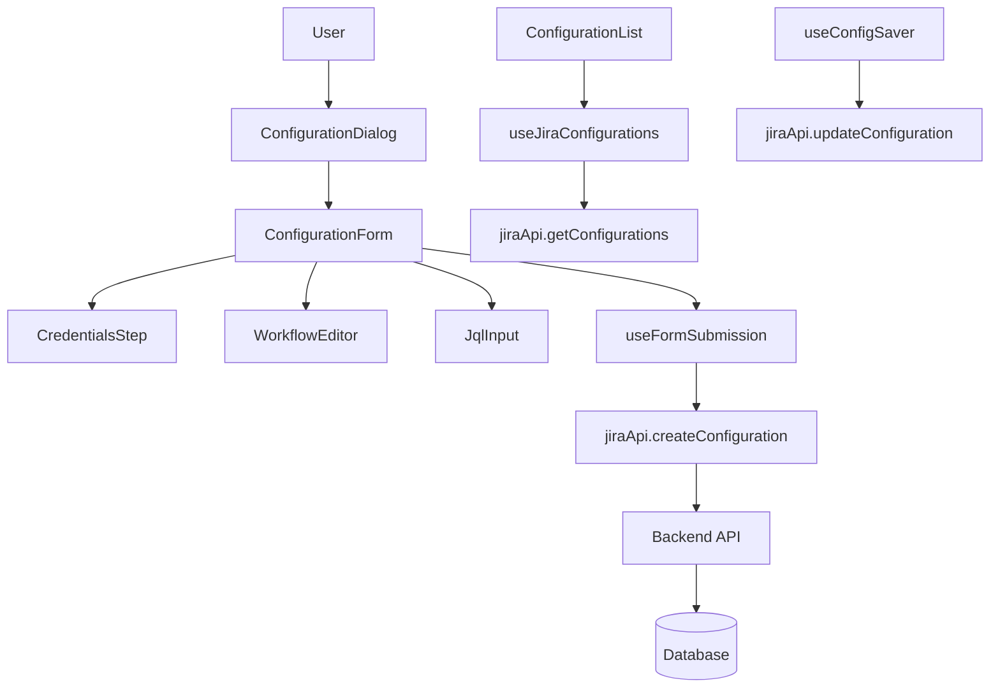

# Configuration Management

## Overview

Configuration Management in Jira Analyzer allows users to create, edit, save, and delete configurations that define how metrics are calculated and visualized. Each configuration contains credentials for connecting to a Jira instance, workflow state definitions, and JQL queries for filtering issues.

## User Workflow

1. **Creating a Configuration**

   - User accesses the Configuration dialog
   - Enters Jira credentials (server URL, email, API token)
   - Validates connection to Jira
   - Selects project and defines workflow states
   - Defines JQL query for issue filtering
   - Saves configuration with a unique name

2. **Editing a Configuration**

   - User selects existing configuration from list
   - Modifies any of the configuration parameters
   - Saves changes, maintaining the same name or creating a new one

3. **Using a Configuration**
   - User selects a saved configuration
   - Clicks "Analyze" to fetch metrics based on configuration settings
   - Views rendered charts and metrics

## Technical Implementation

### Components Involved

- `ConfigurationDialog` - Modal dialog for creating/editing configurations
- `ConfigurationForm` - Form component for configuration details
- `ConfigurationList` - List of saved configurations
- `ConfigurationSection` - Container for configuration management UI
- `useJiraConfigurations` - Hook for managing configuration state
- `useConfigSaver` - Hook for saving configuration changes
- `useNameAvailability` - Hook for checking name uniqueness

### Data Flow



### Configuration Data Structure

```typescript
interface JiraConfiguration {
  name: string;
  jira_server: string;
  jira_email: string;
  jira_api_token: string;
  project_key?: string;
  workflow_states: string[];
  lead_time_start_state: string;
  lead_time_end_state: string;
  cycle_time_start_state: string;
  cycle_time_end_state: string;
  jql_query: string;
}
```

## Edge Cases and Limitations

- **Duplicate Names**: Prevented through useNameAvailability hook
- **Invalid Credentials**: Validation occurs before saving
- **API Rate Limiting**: Backend implements caching and rate limiting for Jira API calls
- **Large Projects**: Performance may degrade with very large Jira projects (>10,000 issues)
- **Complex JQL**: Some complex JQL queries may not be supported or may impact performance

## Best Practices

1. **Configuration Naming**

   - Use descriptive names that identify the project and purpose
   - Example: "Team Alpha Sprint Metrics" or "Backend Project Lead Times"

2. **JQL Queries**

   - Keep queries focused on relevant issues
   - Include time constraints when possible (e.g., `updated > -30d`)
   - Use project keys to narrow scope

3. **Workflow States**
   - Define workflow states that match your team's actual process
   - Set appropriate start/end states for lead time and cycle time

## Future Enhancements

- Configuration templates for common use cases
- Configuration sharing between users
- Automated configuration creation from Jira project analysis
- Multi-project configurations for cross-project metrics
