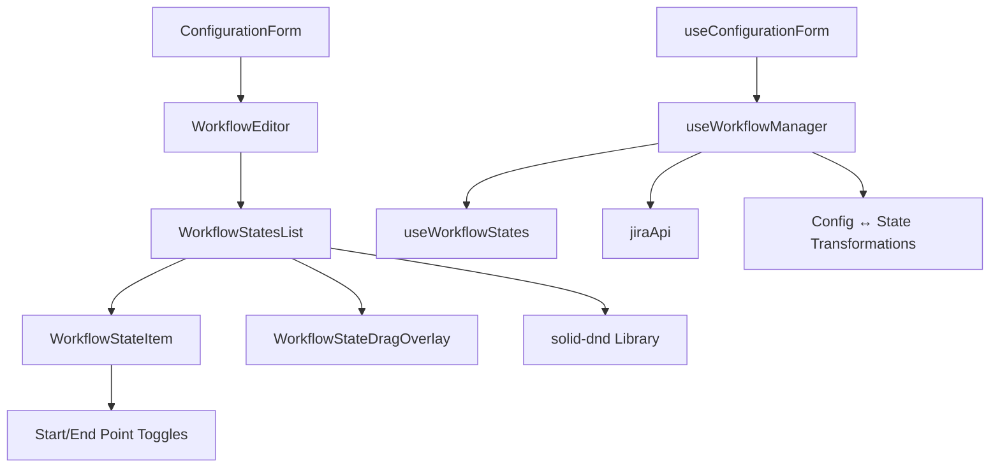

# Workflow Editor

## Overview

The Workflow Editor is a core feature of the Jira Analyzer that enables users to customize and define workflow states for metrics calculations. It provides a visual interface for managing states, designating start and end points for lead time and cycle time metrics, and organizing states in a sequential flow that reflects the team's process.

## User Workflow

1. **Accessing the Workflow Editor**

   - Available when creating a new configuration
   - Available when editing an existing configuration
   - Accessible through the Configuration Section when a configuration is selected

2. **Managing Workflow States**

   - Add new workflow states manually
   - Import workflow states from Jira project
   - Remove unnecessary workflow states
   - Drag and drop to reorder states based on actual workflow

3. **Defining Metric Points**
   - Set start points for lead time and cycle time calculations
   - Set end points for lead time and cycle time calculations

## Detailed Component Architecture

The Workflow Editor feature consists of multiple interconnected components that work together to provide the workflow management functionality:



### Key Component Relationships

- **WorkflowEditor**: Container component that provides UI for editing workflow states

  - Takes workflowStates as input and emits changes via callbacks
  - Handles import from Jira functionality
  - Provides save/cancel actions

- **WorkflowStatesList**: Sortable list with drag-and-drop functionality

  - Manages the UI representation of workflow states
  - Provides adding, removing states
  - Handles drag-and-drop reordering

- **WorkflowStateItem**: Individual state item with toggle controls
  - Displays state name
  - Provides toggle controls for start/end points
  - Handles delete action

## Workflow State Lifecycle

### 1. Creation Phase

Workflow states can be created in two ways:

#### Manual Creation

```typescript
// From useWorkflowStates.ts
const addState = () => {
  if (newStateName().trim()) {
    const newState: WorkflowState = {
      id: generateId(),
      name: newStateName().trim(),
    };
    const newItems = [...items(), newState];
    handleItemsChange(newItems);
    setNewStateName("");
  }
};
```

#### Import from Jira

```typescript
// From useWorkflowManager.ts
const fetchWorkflowStatesFromJira = async (projectKey: string) => {
  setLoadingWorkflow(true);
  setWorkflowError(null);

  try {
    // Fetch workflow states via API
    const workflowStatusList = await jiraApi.getWorkflows(projectKey, config.name);

    // Convert API response to workflow states
    const states = workflowStatusList.map((status) => ({
      id: generateId(),
      name: status.name,
      isStartPoint: false,
      isEndPoint: false,
    }));

    // Auto-detect start/end points based on Jira categories
    const startState = workflowStatusList.find(
      (s) => s.category === "To Do" || s.category === "New"
    );
    const endState = workflowStatusList.find(
      (s) => s.category === "Done" || s.category === "Completed"
    );

    // Update workflow states with detected start/end points
    setWorkflowStates((current) =>
      current.map((state) => ({
        ...state,
        isStartPoint: startState ? state.name === startState.name : state.isStartPoint,
        isEndPoint: endState ? state.name === endState.name : state.isEndPoint,
      }))
    );

    return states;
  } catch (error) {
    setWorkflowError("Failed to fetch workflow states");
    return [];
  } finally {
    setLoadingWorkflow(false);
  }
};
```

### 2. Storage and Persistence

Workflow states are stored in the configuration object with the following transformation:

```typescript
// From useWorkflowManager.ts - Converting UI states to configuration
const updateConfigWithWorkflowStates = (config: JiraConfiguration): JiraConfiguration => {
  const updatedConfig = { ...config };

  // Update workflow states
  updatedConfig.workflow_states = workflowStates().map((state) => state.name);

  // Find start and end states
  const startStates = workflowStates()
    .filter((s) => s.isStartPoint)
    .map((s) => s.name);
  const endStates = workflowStates()
    .filter((s) => s.isEndPoint)
    .map((s) => s.name);

  if (startStates.length > 0) {
    updatedConfig.lead_time_start_state = startStates[0];
    updatedConfig.cycle_time_start_state = startStates[0];
  }

  if (endStates.length > 0) {
    updatedConfig.lead_time_end_state = endStates[0];
    updatedConfig.cycle_time_end_state = endStates[0];
  }

  return updatedConfig;
};

// From useWorkflowManager.ts - Converting configuration to UI states
const configToWorkflowStates = (config: JiraConfiguration): WorkflowState[] => {
  return config.workflow_states.map((name) => ({
    id: generateId(),
    name,
    isStartPoint: name === config.lead_time_start_state || name === config.cycle_time_start_state,
    isEndPoint: name === config.lead_time_end_state || name === config.cycle_time_end_state,
  }));
};
```

### 3. Editing and Reordering

States can be reordered via drag-and-drop:

```typescript
// From useWorkflowStates.ts
const moveItem = (fromIndex: number, toIndex: number) => {
  if (fromIndex !== toIndex) {
    const currentItems = [...items()];
    const [removed] = currentItems.splice(fromIndex, 1);
    currentItems.splice(toIndex, 0, removed);
    handleItemsChange(currentItems);
  }
};
```

Start and end points can be toggled:

```typescript
// From useWorkflowStates.ts
const toggleStartPoint = (id: string) => {
  const newItems = items().map((item) => {
    if (item.id === id) {
      return { ...item, isStartPoint: !item.isStartPoint };
    }
    return item;
  });
  handleItemsChange(newItems);
};

const toggleEndPoint = (id: string) => {
  const newItems = items().map((item) => {
    if (item.id === id) {
      return { ...item, isEndPoint: !item.isEndPoint };
    }
    return item;
  });
  handleItemsChange(newItems);
};
```

## Technical Implementation

### Components Involved

- `WorkflowEditor` - Main component for workflow state management
- `WorkflowStatesList` - Sortable list of workflow states
- `WorkflowStateItem` - Individual state item component
- `WorkflowStateDragOverlay` - Visual feedback during drag operations
- `useWorkflowManager` - Hook for workflow state management
- `useWorkflowStates` - Hook for workflow state operations
- `solid-dnd` - Library for drag-and-drop functionality

### Workflow State Data Structure

```typescript
// UI representation for workflow states
interface WorkflowState {
  id: string; // Unique identifier for the state in the UI
  name: string; // Display name of the workflow state
  isStartPoint?: boolean; // Whether this state is a start point for metrics
  isEndPoint?: boolean; // Whether this state is an end point for metrics
}

// Storage representation in configuration
interface JiraConfiguration {
  // ...other fields
  workflow_states: string[]; // Array of state names
  lead_time_start_state: string; // Name of lead time start state
  lead_time_end_state: string; // Name of lead time end state
  cycle_time_start_state: string; // Name of cycle time start state
  cycle_time_end_state: string; // Name of cycle time end state
}
```

### Drag and Drop Implementation

The drag and drop functionality is implemented using the solid-dnd library, which provides a smooth user experience for reordering workflow states:

```typescript
// From WorkflowStatesList.tsx
<DragDropProvider onDragStart={onDragStart} onDragEnd={onDragEnd} collisionDetector={closestCenter}>
  <DragDropSensors />
  <div class="overflow-hidden rounded-md border border-gray-200 bg-white">
    <SortableProvider ids={stateManager.ids()}>
      <For each={stateManager.items()}>
        {(item) => (
          <WorkflowStateItem
            item={item}
            onRemove={stateManager.removeState}
            onToggleStartPoint={stateManager.toggleStartPoint}
            onToggleEndPoint={stateManager.toggleEndPoint}
          />
        )}
      </For>
    </SortableProvider>
  </div>
</DragDropProvider>
```

The drag event handlers manage the state updates:

```typescript
// From WorkflowStatesList.tsx
const onDragStart = (event: DragEvent) => {
  if (event.draggable) {
    stateManager.setActiveItem(String(event.draggable.id));
  }
};

const onDragEnd = (event: DragEvent) => {
  try {
    // Handle drag and drop case
    if (event.draggable && event.droppable) {
      const fromIndex = stateManager.ids().indexOf(String(event.draggable.id));
      const toIndex = stateManager.ids().indexOf(String(event.droppable.id));

      stateManager.moveItem(fromIndex, toIndex);
    }
  } catch (error) {
    console.error("Error during drag operation:", error);
  } finally {
    // Always reset active item to ensure clean state
    stateManager.setActiveItem(null);
  }
};
```

## Metrics Integration

The workflow states defined in the editor play a critical role in metrics calculations. The states designated as start and end points are used to calculate key metrics:

### Lead Time Calculation

Lead time measures the total time from when an issue is created until it reaches the designated end state. In the workflow editor:

1. **Lead Time Start Point**: Typically set to the first state in the workflow (e.g., "Backlog" or "To Do")
2. **Lead Time End Point**: Typically set to the final state (e.g., "Done" or "Completed")

The calculation is based on timestamps of when issues entered these specific states:

```text
Lead Time = Time entered End State - Time entered Start State
```

### Cycle Time Calculation

Cycle time measures the time an issue spends in active development. In the workflow editor:

1. **Cycle Time Start Point**: Typically set to the "In Progress" state
2. **Cycle Time End Point**: Typically set to the final state (e.g., "Done")

The calculation is:

```text
Cycle Time = Time entered End State - Time entered Start State
```

### Workflow States Impact on Visualizations

The order of workflow states directly impacts the Cumulative Flow Diagram (CFD) visualization:

- Each state becomes a "band" in the CFD
- The order of states determines how the bands are stacked
- States are colored according to their position

The Work in Progress (WIP) metrics also use the workflow states to count issues in each state at a given time.

## Troubleshooting

### Common Issues and Solutions

1. **Missing Start/End Points**

   - **Problem**: Metrics cannot be calculated if start/end points are not defined
   - **Solution**: Ensure at least one state is marked as a start point and one as an end point

2. **Jira Import Failures**

   - **Problem**: Unable to fetch workflow states from Jira
   - **Solution**:
     - Verify Jira credentials and connection
     - Check if the project key is correct
     - Ensure the Jira instance is accessible

3. **Incorrect State Mapping**

   - **Problem**: Jira states don't match expected workflow
   - **Solution**:
     - Manually edit imported states
     - Reorder states to match actual workflow
     - Add missing states manually

4. **Invalid Configuration After Save**
   - **Problem**: Configuration validation fails due to workflow issues
   - **Solution**:
     - Check for duplicate state names
     - Ensure start/end points are defined
     - Verify state names match Jira state names if needed

## Usage Examples

### Basic Linear Workflow

For a simple development process:

1. **States Configuration**:

   - Backlog (Start point for Lead Time)
   - To Do
   - In Progress (Start point for Cycle Time)
   - Review
   - Done (End point for both Lead Time and Cycle Time)

2. **Metrics Interpretation**:
   - Lead Time: Total time from issue creation to completion
   - Cycle Time: Time spent in active development and review

### Complex Workflow with Parallel States

For teams with multiple parallel tracks:

1. **States Configuration**:

   - Backlog (Start point for Lead Time)
   - To Do
   - In Progress (Start point for Cycle Time)
   - Design Review
   - Code Review
   - QA Testing
   - Ready for Release
   - Released (End point for both Lead Time and Cycle Time)

2. **Handling Parallel States**:
   - Order states in the most common flow path
   - For metrics analysis, the system tracks actual state transitions
   - In visualizations, states are displayed in the configured order

### Non-Standard Jira Workflow Mapping

When Jira workflows contain custom or complex states:

1. **Import and Cleanup**:

   - Import all states from Jira
   - Remove states not relevant for metrics (e.g., "Archived")
   - Combine similar states if needed (e.g., different types of "In Progress")
   - Ensure a clear linear progression for metrics calculation

2. **Manual Configuration Example**:
   - Original Jira states: "Open", "In Progress (Design)", "In Progress (Dev)", "Testing", "Verified", "Closed"
   - Simplified workflow: "Open", "In Progress", "Testing", "Done"
   - Mapping: "In Progress (Design)" and "In Progress (Dev)" are treated as "In Progress", "Verified" and "Closed" are treated as "Done"

## Best Practices

1. **State Organization**

   - Order states to reflect the actual flow of work
   - Include only states relevant to the metrics you want to analyze
   - Use consistent naming conventions

2. **Start and End Points**

   - For lead time, typically set the start point at the creation/backlog state
   - For cycle time, typically set the start point at the in-progress state
   - For both metrics, set the end point at the done/completed state

3. **Fetching from Jira**

   - When possible, start by importing states from the actual Jira project
   - Modify the imported states rather than creating from scratch
   - Use Jira's state categories (To Do, In Progress, Done) as guidance for setting start/end points

4. **Regular Maintenance**
   - Update workflow states when Jira workflows change
   - Review configuration periodically to ensure it reflects the current process
   - Consider the impact of workflow changes on historical metrics

## Future Enhancements

- Visual workflow diagram with connectors between states
- Support for parallel workflow paths
- State color coding based on Jira categories
- Historical state transition analysis
- Custom state grouping for advanced metrics
- Ability to define multiple start/end points for different metric types
- Automated workflow recommendations based on Jira usage patterns
