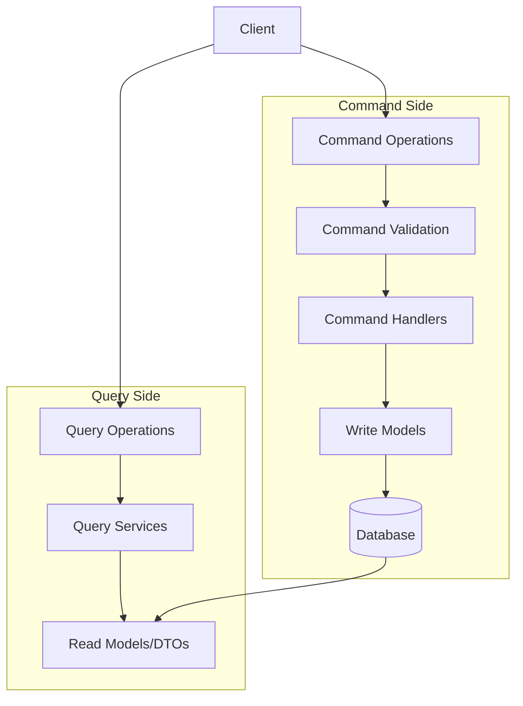

# Command Query Responsibility Segregation (CQRS)

> **Executive Summary:** Jira Analyzer implements CQRS to separate read and write operations. Commands represent intentions to change state with explicit validation and dedicated handlers. Queries retrieve data without side effects and are optimized for reading. This separation improves maintainability, performance, and scalability.

<!--
Last Updated: 08/04/2025
Related Documents:
- [Memory Bank Index](../INDEX.md)
- [Project Brief](../projectbrief.md)
- [Product Context](../productContext.md)
- [System Patterns](../systemPatterns.md)
- [Tech Context](../techContext.md)
- [SOLID Principles](./solid.md)
- [Functional Programming](./functional-programming.md)
-->

## Quick Reference

| Aspect             | Command Side                                                | Query Side                                  |
| ------------------ | ----------------------------------------------------------- | ------------------------------------------- |
| **Purpose**        | Modify state                                                | Read state                                  |
| **Implementation** | Explicit command objects with validation                    | Query services optimized for reading        |
| **Examples**       | `CreateConfigurationCommand`, `UpdateWorkflowStatesCommand` | `GetConfigurationsQuery`, `GetMetricsQuery` |
| **Processing**     | Command handlers with business logic                        | Query services with potential caching       |
| **Focus**          | Data consistency and validation                             | Performance and optimization                |
| **Side Effects**   | May have side effects                                       | No side effects                             |

## Table of Contents

- [Overview](#overview)
- [Implementation Principles](#implementation-principles)
  - [Command Side](#command-side)
  - [Query Side](#query-side)
- [Backend Implementation](#backend-implementation)
  - [Command Examples](#command-examples)
  - [Query Examples](#query-examples)
  - [Directory Structure](#directory-structure)
- [Frontend Implementation](#frontend-implementation)
  - [Command-like Operations](#command-like-operations)
  - [Query-like Operations](#query-like-operations)
- [Benefits in Our Context](#benefits-in-our-context)
- [Implementation Guidelines](#implementation-guidelines)

## Overview

CQRS is an architectural pattern that separates read and write operations for a data store. In the Jira Analyzer, we implement CQRS to achieve:

- Clear separation of concerns
- Optimized data models for different operations
- Improved scalability and performance
- Better maintainability through focused components

## Implementation Principles



### Command Side

Commands represent intentions to change the system state. They are:

1. **Explicit Objects**: Commands are explicit objects with clear intent

   ```typescript
   interface SaveConfigurationCommand {
     name: string;
     credentials: JiraCredentials;
     projectKey: string;
     workflowStates: WorkflowState[];
     jql?: string;
   }
   ```

2. **Validated Before Processing**: Commands undergo validation before execution

   ```typescript
   function validateSaveConfigurationCommand(command: SaveConfigurationCommand): ValidationResult {
     // Validation logic
   }
   ```

3. **Handled by Dedicated Handlers**: Each command has a specific handler

   ```typescript
   class SaveConfigurationCommandHandler {
     constructor(private repository: ConfigurationRepository) {}

     async handle(command: SaveConfigurationCommand): Promise<Result> {
       // Command handling logic
     }
   }
   ```

4. **Focused on Data Consistency**: Write models prioritize data integrity

### Query Side

Queries retrieve data without modifying state. They are:

1. **Optimized for Reading**: Query models are denormalized for efficient retrieval

   ```typescript
   interface ConfigurationSummaryDto {
     id: number;
     name: string;
     projectKey: string;
     lastUsed: Date;
     stateCount: number;
   }
   ```

2. **Implemented as Services**: Query operations are grouped in services

   ```typescript
   class ConfigurationQueryService {
     constructor(private repository: ConfigurationRepository) {}

     async getConfigurationSummaries(): Promise<ConfigurationSummaryDto[]> {
       // Query implementation
     }

     async getConfigurationDetails(id: number): Promise<ConfigurationDetailDto> {
       // Query implementation
     }
   }
   ```

3. **Potentially Cached**: Read operations can be cached for performance

   ```typescript
   @Cached({ ttl: 300 })
   async getConfigurationSummaries(): Promise<ConfigurationSummaryDto[]> {
     // Implementation
   }
   ```

## Backend Implementation

### Command Examples

- `CreateConfigurationCommand`
- `UpdateWorkflowStatesCommand`
- `DeleteConfigurationCommand`
- `ValidateCredentialsCommand`

### Query Examples

- `GetConfigurationsQuery`
- `GetMetricsQuery`
- `GetProjectsQuery`
- `GetWorkflowStatesQuery`

### Directory Structure

```bash
backend/
  app/
    commands/                  # Command definitions and handlers
      create_configuration.py
      update_workflow_states.py
      ...
    queries/                   # Query services
      configuration_queries.py
      metrics_queries.py
      ...
    models/                    # Domain models (write models)
      configuration.py
      workflow_state.py
      ...
    dto/                       # Data Transfer Objects (read models)
      configuration_dto.py
      metrics_dto.py
      ...
```

## Frontend Implementation

While the frontend doesn't strictly implement CQRS, it follows similar principles:

### Command-like Operations

- API calls that modify state are grouped in dedicated modules
- Mutations are handled through explicit functions

```typescript
// Command-like operation
async function saveConfiguration(config: ConfigurationData): Promise<Result> {
  try {
    const response = await api.post("/configurations", config);
    return { success: true, data: response.data };
  } catch (error) {
    return { success: false, error };
  }
}
```

### Query-like Operations

- Data fetching is separated from state modification
- Read operations are optimized for UI needs

```typescript
// Query-like operation
async function getConfigurations(): Promise<ConfigurationSummary[]> {
  const response = await api.get("/configurations");
  return response.data;
}
```

## Benefits in Our Context

1. **Clearer Code Organization**: Separating reads and writes makes the codebase more navigable
2. **Optimized Data Models**: Different models for reading and writing improve performance
3. **Focused Testing**: Command handlers and query services can be tested in isolation
4. **Scalability**: Read and write operations can be scaled independently if needed
5. **Maintainability**: Changes to one side don't necessarily affect the other

## Implementation Guidelines

1. **Start Simple**: Begin with logical separation before physical separation
2. **Be Pragmatic**: Not every feature needs full CQRS implementation
3. **Consistent Naming**: Use clear naming conventions for commands and queries
4. **Validate Early**: Commands should be validated before reaching handlers
5. **Document Boundaries**: Clearly document the responsibilities of each side
