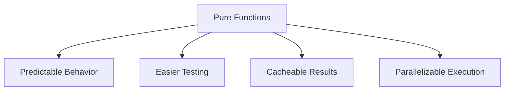
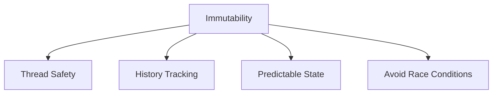
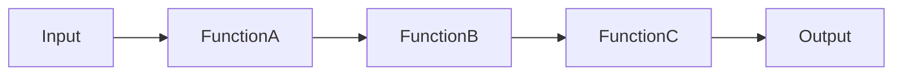

# Functional Programming Principles

> **Executive Summary:** Jira Analyzer applies functional programming principles to create more predictable, testable, and maintainable code. The project emphasizes pure functions that produce consistent outputs for the same inputs, immutable data structures to avoid side effects, function composition to build complex operations from simple ones, higher-order functions, and declarative programming approaches.

<!--
Last Updated: 08/04/2025
Related Documents:
- [Memory Bank Index](../INDEX.md)
- [Project Brief](../projectbrief.md)
- [Product Context](../productContext.md)
- [System Patterns](../systemPatterns.md)
- [Tech Context](../techContext.md)
- [SOLID Principles](./solid.md)
- [CQRS Pattern](./cqrs.md)
-->

## Quick Reference

| Principle                   | Description                                     | Frontend Example                                               | Backend Example                                                 |
| --------------------------- | ----------------------------------------------- | -------------------------------------------------------------- | --------------------------------------------------------------- |
| **Pure Functions**          | Same output for same input, no side effects     | `calculateLeadTime(startDate, endDate)`                        | `calculate_cycle_time(issues, start_state, end_state)`          |
| **Immutability**            | Create new data structures instead of modifying | `setStates(prevStates => [...prevStates, newState])`           | `@dataclass(frozen=True) class Configuration`                   |
| **Function Composition**    | Build complex functions from simple ones        | `const processIssueData = pipe(fetchIssues, filterByJql, ...)` | `def process_metrics_data(issues, config): return pipe(...)`    |
| **Higher-Order Functions**  | Functions that take/return other functions      | `withErrorHandling(() => api.get("/configurations"))`          | `@with_cache(ttl_seconds=60) async def get_projects(...)`       |
| **Declarative Programming** | Express what to do, not how to do it            | `configurations.filter(c => c.active).map(c => ({...}))`       | `@router.get("/configurations") async def get_configurations()` |

## Table of Contents

- [Overview](#overview)
- [Core Principles](#core-principles)
  - [1. Pure Functions](#1-pure-functions)
  - [2. Immutability](#2-immutability)
  - [3. Function Composition](#3-function-composition)
  - [4. Higher-Order Functions](#4-higher-order-functions)
  - [5. Declarative Programming](#5-declarative-programming)
- [Benefits in Our Context](#benefits-in-our-context)
- [Implementation Guidelines](#implementation-guidelines)

## Overview

Functional programming is a paradigm that treats computation as the evaluation of mathematical functions and avoids changing state and mutable data. In the Jira Analyzer project, we apply functional programming principles to create more predictable, testable, and maintainable code.

## Core Principles

### 1. Pure Functions

> Pure functions always produce the same output for the same input and have no side effects.

#### Implementation in Jira Analyzer



**Frontend Examples**:

```typescript
// Pure function for calculating lead time
function calculateLeadTime(startDate: Date, endDate: Date): number {
  return Math.floor((endDate.getTime() - startDate.getTime()) / (1000 * 60 * 60 * 24));
}

// Pure function for filtering workflow states
function filterActiveStates(states: WorkflowState[]): WorkflowState[] {
  return states.filter((state) => state.active);
}

// Pure function for formatting dates
function formatDate(date: Date, format: string): string {
  // Implementation that always returns the same output for the same input
  return format
    .replace("YYYY", date.getFullYear().toString())
    .replace("MM", (date.getMonth() + 1).toString().padStart(2, "0"))
    .replace("DD", date.getDate().toString().padStart(2, "0"));
}
```

**Backend Examples**:

```python
# Pure function for calculating cycle time
def calculate_cycle_time(issues: List[Issue], start_state: str, end_state: str) -> float:
    cycle_times = []
    for issue in issues:
        start_date = get_state_entry_date(issue, start_state)
        end_date = get_state_entry_date(issue, end_state)
        if start_date and end_date:
            cycle_times.append((end_date - start_date).days)
    return sum(cycle_times) / len(cycle_times) if cycle_times else 0

# Pure function for validating JQL
def is_valid_jql(jql: str) -> bool:
    # Implementation that always returns the same result for the same input
    pattern = r'^[a-zA-Z]+ (=|!=|>|<|>=|<=) "[^"]*"( (AND|OR) [a-zA-Z]+ (=|!=|>|<|>=|<=) "[^"]*")*$'
    return bool(re.match(pattern, jql))
```

### 2. Immutability

> Once created, data should not be modified. Instead, create new data structures.

#### Implementation in Jira Analyzer



**Frontend Examples**:

```typescript
// Immutable state updates in hooks
function useWorkflowManager(initialStates: WorkflowState[]) {
  const [states, setStates] = useState(initialStates);

  // Update function creates a new array instead of modifying the existing one
  const updateState = (id: number, updates: Partial<WorkflowState>) => {
    setStates((prevStates) =>
      prevStates.map((state) => (state.id === id ? { ...state, ...updates } : state))
    );
  };

  // Add function creates a new array with the added state
  const addState = (newState: WorkflowState) => {
    setStates((prevStates) => [...prevStates, newState]);
  };

  // Remove function creates a new array without the removed state
  const removeState = (id: number) => {
    setStates((prevStates) => prevStates.filter((state) => state.id !== id));
  };

  return { states, updateState, addState, removeState };
}
```

**Backend Examples**:

```python
# Immutable data classes
@dataclass(frozen=True)
class Configuration:
    id: int
    name: str
    project_key: str
    workflow_states: Tuple[WorkflowState, ...]
    jql: Optional[str] = None

    def with_updated_states(self, new_states: List[WorkflowState]) -> 'Configuration':
        # Returns a new instance instead of modifying the existing one
        return Configuration(
            id=self.id,
            name=self.name,
            project_key=self.project_key,
            workflow_states=tuple(new_states),
            jql=self.jql
        )
```

### 3. Function Composition

> Building complex functions by combining simpler functions.

#### Implementation in Jira Analyzer



**Frontend Examples**:

```typescript
// Composing data transformation functions
const processIssueData = pipe(
  fetchIssues, // Fetch raw issue data
  filterByJql, // Filter issues by JQL
  groupByWorkflowState, // Group issues by workflow state
  calculateMetrics // Calculate metrics from grouped issues
);

// Usage
const metrics = processIssueData(configurationId);

// Implementation of pipe utility
function pipe<T>(...fns: Array<(arg: any) => any>) {
  return (x: T) => fns.reduce((v, f) => f(v), x);
}
```

**Backend Examples**:

```python
# Function composition for data processing pipeline
def process_metrics_data(issues: List[Issue], config: Configuration) -> MetricsResult:
    return pipe(
        filter_by_date_range,
        group_by_workflow_state,
        calculate_lead_times,
        calculate_cycle_times,
        format_for_response
    )(issues, config)

# Implementation of pipe utility
def pipe(*functions):
    def apply(data, *args):
        result = data
        for func in functions:
            result = func(result, *args)
        return result
    return apply
```

### 4. Higher-Order Functions

> Functions that take other functions as arguments or return functions.

#### Implementation in Jira Analyzer

**Frontend Examples**:

```typescript
// Higher-order function for creating API request handlers with error handling
function withErrorHandling<T>(apiCall: () => Promise<T>) {
  return async (): Promise<Result<T>> => {
    try {
      const data = await apiCall();
      return { success: true, data };
    } catch (error) {
      console.error("API Error:", error);
      return {
        success: false,
        error: error instanceof Error ? error.message : "Unknown error",
      };
    }
  };
}

// Usage
const getConfigurationsWithErrorHandling = withErrorHandling(() => api.get("/configurations"));

// Higher-order component for charts with loading states
function withLoadingState<P>(Component: React.ComponentType<P>) {
  return function WithLoadingState(props: P & { loading: boolean }) {
    const { loading, ...rest } = props;
    if (loading) {
      return <LoadingSpinner />;
    }
    return <Component {...(rest as P)} />;
  };
}

// Usage
const LeadTimeChartWithLoading = withLoadingState(LeadTimeChart);
```

**Backend Examples**:

```python
# Higher-order function for caching results
def with_cache(ttl_seconds: int = 300):
    def decorator(func):
        cache = {}

        async def wrapper(*args, **kwargs):
            key = str(args) + str(kwargs)
            now = time.time()

            if key in cache and now - cache[key]['timestamp'] < ttl_seconds:
                return cache[key]['result']

            result = await func(*args, **kwargs)
            cache[key] = {'result': result, 'timestamp': now}
            return result

        return wrapper
    return decorator

# Usage
@with_cache(ttl_seconds=60)
async def get_projects(config_name: str) -> List[Project]:
    # Implementation
```

### 5. Declarative Programming

> Expressing the logic of computation without describing its control flow.

#### Implementation in Jira Analyzer

**Frontend Examples**:

```typescript
// Declarative component rendering
function ConfigurationList({ configurations, onSelect }) {
  return (
    <div className="configuration-list">
      {configurations.length === 0 ? (
        <EmptyState message="No configurations found" />
      ) : (
        configurations.map((config) => (
          <ConfigurationItem
            key={config.id}
            configuration={config}
            onSelect={() => onSelect(config.id)}
          />
        ))
      )}
    </div>
  );
}

// Declarative data transformation
const activeConfigurations = configurations
  .filter((config) => config.active)
  .sort((a, b) => b.lastUsed.getTime() - a.lastUsed.getTime())
  .map((config) => ({
    id: config.id,
    name: config.name,
    projectKey: config.projectKey,
    stateCount: config.workflowStates.length,
  }));
```

**Backend Examples**:

```python
# Declarative API route definitions
@router.get("/configurations", response_model=List[ConfigurationSummary])
async def get_configurations(
    service: ConfigurationService = Depends(get_configuration_service)
):
    return await service.get_configurations()

# Declarative data transformation
def transform_issues_to_metrics(issues: List[Issue]) -> MetricsData:
    return {
        "lead_time": calculate_average_lead_time(issues),
        "cycle_time": calculate_average_cycle_time(issues),
        "throughput": calculate_throughput_by_week(issues),
        "wip": calculate_wip_by_day(issues),
        "state_distribution": calculate_state_distribution(issues)
    }
```

## Benefits in Our Context

1. **Predictability**: Pure functions and immutability make code behavior more predictable
2. **Testability**: Pure functions are easier to test since they have no side effects
3. **Maintainability**: Smaller, composable functions are easier to understand and maintain
4. **Concurrency**: Immutable data and pure functions enable safer concurrent operations
5. **Debugging**: Function composition creates clear data transformation pipelines

## Implementation Guidelines

1. **Start with Pure Functions**: Identify and isolate pure computational logic
2. **Use Immutable Data Structures**: Avoid direct mutations of objects and arrays
3. **Compose Functions**: Build complex operations from simple, reusable functions
4. **Separate Side Effects**: Isolate side effects (API calls, state updates) from pure logic
5. **Prefer Declarative Style**: Express what should happen, not how it should happen
