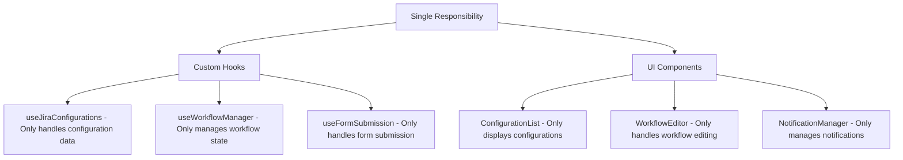
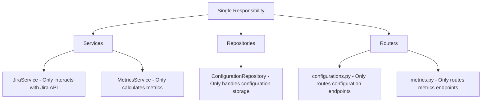

# SOLID Principles Implementation

> **Executive Summary:** The Jira Analyzer implements SOLID principles throughout the codebase. Single Responsibility is achieved through focused hooks and services. Open/Closed is implemented via component composition and service interfaces. Liskov Substitution ensures consistent contracts. Interface Segregation creates granular hooks and repositories. Dependency Inversion uses props injection and a DI container.

<!--
Last Updated: 08/04/2025
Related Documents:
- [Memory Bank Index](../INDEX.md)
- [Project Brief](../projectbrief.md)
- [Product Context](../productContext.md)
- [System Patterns](../systemPatterns.md)
- [Tech Context](../techContext.md)
- [CQRS Pattern](./cqrs.md)
- [Functional Programming](./functional-programming.md)
-->

## Quick Reference

| Principle                       | Frontend Implementation                                                         | Backend Implementation                                           |
| ------------------------------- | ------------------------------------------------------------------------------- | ---------------------------------------------------------------- |
| **Single Responsibility (SRP)** | Custom hooks with one concern (e.g., `useJiraConfigurations`)                   | Focused services and repositories (e.g., `ConfigurationService`) |
| **Open/Closed (OCP)**           | Component composition (e.g., `BaseChart` extended by specific charts)           | Service interfaces with multiple implementations                 |
| **Liskov Substitution (LSP)**   | Consistent component props contracts                                            | Proper inheritance hierarchies in services                       |
| **Interface Segregation (ISP)** | Granular custom hooks (e.g., separate hooks for form validation and submission) | Focused repository interfaces                                    |
| **Dependency Inversion (DIP)**  | Props injection and React Context                                               | Dependency injection container                                   |

## Table of Contents

- [Overview](#overview)
- [Single Responsibility Principle (SRP)](#single-responsibility-principle-srp)
  - [Implementation in Jira Analyzer](#implementation-in-jira-analyzer)
- [Open/Closed Principle (OCP)](#openclosed-principle-ocp)
  - [Implementation in Jira Analyzer](#implementation-in-jira-analyzer-1)
- [Liskov Substitution Principle (LSP)](#liskov-substitution-principle-lsp)
  - [Implementation in Jira Analyzer](#implementation-in-jira-analyzer-2)
- [Interface Segregation Principle (ISP)](#interface-segregation-principle-isp)
  - [Implementation in Jira Analyzer](#implementation-in-jira-analyzer-3)
- [Dependency Inversion Principle (DIP)](#dependency-inversion-principle-dip)
  - [Implementation in Jira Analyzer](#implementation-in-jira-analyzer-4)
- [Benefits in Our Context](#benefits-in-our-context)
- [Implementation Guidelines](#implementation-guidelines)

## Overview

SOLID is an acronym for five design principles that help create more maintainable, flexible, and robust software. In the Jira Analyzer project, we adhere to these principles to ensure code quality and maintainability.

## Single Responsibility Principle (SRP)

> A class should have only one reason to change.

### Implementation in Jira Analyzer

#### Frontend Implementation



1. **Custom Hooks**: Each hook has a single responsibility

   - `useJiraConfigurations`: Manages configuration data fetching and caching
   - `useWorkflowManager`: Handles workflow state management
   - `useFormSubmission`: Manages form submission logic

2. **Components**: Each component focuses on a specific aspect of the UI
   - `ConfigurationList`: Displays configuration items
   - `WorkflowEditor`: Provides workflow editing capabilities
   - `NotificationManager`: Handles user notifications

#### Backend Implementation



1. **Services**: Each service handles a specific domain

   - `JiraService`: Handles Jira API interactions
   - `MetricsService`: Calculates metrics from Jira data
   - `ConfigurationService`: Manages configuration operations

2. **Repositories**: Each repository focuses on a specific data access concern

   - `ConfigurationRepository`: Handles configuration storage and retrieval
   - `JiraClientRepository`: Manages Jira client instances

3. **Routers**: Each router handles a specific API domain
   - `configurations.py`: Routes for configuration management
   - `metrics.py`: Routes for metrics calculations
   - `jira.py`: Routes for Jira API interactions

## Open/Closed Principle (OCP)

> Software entities should be open for extension but closed for modification.

### Implementation in Jira Analyzer

#### Frontend Implementation

1. **Component Composition**: Components are extended through composition rather than modification

   ```tsx
   // Base chart component that can be extended
   function BaseChart({ data, renderChart, loading, error }) {
     if (loading) return <LoadingSpinner />;
     if (error) return <ErrorMessage error={error} />;
     if (!data || data.length === 0) return <EmptyState />;

     return <div className="chart-container">{renderChart(data)}</div>;
   }

   // Extended through composition
   function LeadTimeChart(props) {
     return <BaseChart {...props} renderChart={(data) => <D3LeadTimeChart data={data} />} />;
   }
   ```

2. **Hook Composition**: Custom hooks are extended through composition

   ```tsx
   function useConfigurationForm() {
     // Base form functionality
     const formData = useFormDataManager();
     const validation = useFormValidation();
     const submission = useFormSubmission();

     // Extended functionality through composition
     return {
       ...formData,
       ...validation,
       ...submission,
       // Additional functionality specific to configuration form
     };
   }
   ```

#### Backend Implementation

1. **Service Interfaces**: Services implement interfaces that can be extended

   ```python
   class JiraClientInterface(Protocol):
       async def get_issues(self, jql: str) -> List[Issue]:
           ...

       async def get_projects(self) -> List[Project]:
           ...

   # Concrete implementation
   class JiraCloudClient(JiraClientInterface):
       # Implementation for Jira Cloud

   class JiraServerClient(JiraClientInterface):
       # Implementation for Jira Server
   ```

2. **Middleware Pipeline**: API requests flow through extensible middleware

   ```python
   app = FastAPI()

   # Add middleware without modifying existing code
   app.add_middleware(RateLimitMiddleware)
   app.add_middleware(AuthenticationMiddleware)
   app.add_middleware(LoggingMiddleware)
   ```

## Liskov Substitution Principle (LSP)

> Subtypes must be substitutable for their base types.

### Implementation in Jira Analyzer

#### Frontend Implementation

1. **Component Props Contracts**: Child components respect parent component contracts

   ```tsx
   // Base chart component contract
   interface ChartProps {
     data: any[];
     title: string;
     height?: number;
     width?: number;
   }

   // LeadTimeChart respects and extends the contract
   interface LeadTimeChartProps extends ChartProps {
     dateFormat?: string;
   }

   // Can be used anywhere ChartProps is expected
   function LeadTimeChart(props: LeadTimeChartProps) {
     // Implementation
   }
   ```

#### Backend Implementation

1. **Service Inheritance**: Derived services maintain the base service contract

   ```python
   class BaseMetricsService:
       async def calculate_lead_time(self, issues: List[Issue]) -> LeadTimeMetrics:
           # Base implementation

   class EnhancedMetricsService(BaseMetricsService):
       async def calculate_lead_time(self, issues: List[Issue]) -> LeadTimeMetrics:
           # Enhanced implementation that still returns LeadTimeMetrics
           # and doesn't violate the base contract
   ```

## Interface Segregation Principle (ISP)

> Clients should not be forced to depend on interfaces they do not use.

### Implementation in Jira Analyzer

#### Frontend Implementation

1. **Granular Custom Hooks**: Hooks provide focused functionality

   ```tsx
   // Instead of one large hook with many functions
   function useWorkflowEditor() {
     // Specific to workflow editing
   }

   function useCredentialsManager() {
     // Specific to credentials management
   }

   function useJqlBuilder() {
     // Specific to JQL building
   }
   ```

2. **Component Props**: Components only receive props they need

   ```tsx
   // Instead of passing all configuration data
   function WorkflowEditor({ workflowStates, onStateChange }) {
     // Only uses workflow states, not other configuration data
   }

   function CredentialsForm({ credentials, onCredentialsChange }) {
     // Only uses credentials, not other configuration data
   }
   ```

#### Backend Implementation

1. **Focused Repository Interfaces**: Repositories expose specific methods

   ```python
   class ConfigurationRepository:
       async def get_configurations(self) -> List[Configuration]:
           ...

       async def save_configuration(self, config: Configuration) -> Configuration:
           ...

   class JiraClientRepository:
       async def get_client(self, credentials: JiraCredentials) -> JiraClient:
           ...
   ```

2. **API Route Separation**: Routes are organized by domain

   ```python
   # configurations.py - Only configuration endpoints
   router = APIRouter()

   @router.get("/configurations")
   async def get_configurations():
       ...

   # metrics.py - Only metrics endpoints
   router = APIRouter()

   @router.get("/metrics/{config_id}")
   async def get_metrics(config_id: int):
       ...
   ```

## Dependency Inversion Principle (DIP)

> High-level modules should not depend on low-level modules. Both should depend on abstractions.

### Implementation in Jira Analyzer

#### Frontend Implementation

1. **Props Injection**: Components receive dependencies via props

   ```tsx
   // Component depends on abstractions (props interface), not concrete implementations
   function ConfigurationList({ configurations, onSelect, onDelete }) {
     // Uses the provided functions without knowing their implementation
   }

   // Usage with concrete implementations
   <ConfigurationList
     configurations={configurations}
     onSelect={handleSelect}
     onDelete={handleDelete}
   />;
   ```

2. **Context for Global Dependencies**: React Context provides dependencies

   ```tsx
   const NotificationContext = createContext(null);

   function App() {
     const notificationService = useNotificationService();

     return (
       <NotificationContext.Provider value={notificationService}>
         <AppContent />
       </NotificationContext.Provider>
     );
   }

   // Components depend on the abstraction (context), not the implementation
   function ErrorBoundary() {
     const notifications = useContext(NotificationContext);

     // Use notifications without knowing the implementation
   }
   ```

#### Backend Implementation

1. **Dependency Injection Container**: Services receive dependencies via DI

   ```python
   # Container configuration
   container = Container()
   container.register(ConfigurationRepository)
   container.register(JiraClientRepository)
   container.register(ConfigurationService, dependencies=[ConfigurationRepository])
   container.register(JiraService, dependencies=[JiraClientRepository])

   # Service depends on abstraction (repository interface)
   class ConfigurationService:
       def __init__(self, repository: ConfigurationRepository):
           self.repository = repository
   ```

2. **FastAPI Dependency Injection**: Endpoints receive dependencies via FastAPI DI

   ```python
   @router.get("/configurations")
   async def get_configurations(
       service: ConfigurationService = Depends(get_configuration_service)
   ):
       # Endpoint depends on service abstraction, not implementation
       return await service.get_configurations()
   ```

## Benefits in Our Context

1. **Maintainability**: Code is easier to understand and modify
2. **Testability**: Components and services can be tested in isolation
3. **Flexibility**: New features can be added without modifying existing code
4. **Reusability**: Well-designed components and services can be reused
5. **Scalability**: The codebase can grow without becoming unwieldy

## Implementation Guidelines

1. **Start with Clear Responsibilities**: Identify and separate concerns
2. **Use Composition Over Inheritance**: Prefer composing objects over inheritance hierarchies
3. **Design for Extension**: Anticipate future changes and design for extension
4. **Focus on Interfaces**: Define clear interfaces before implementations
5. **Inject Dependencies**: Provide dependencies rather than creating them internally
