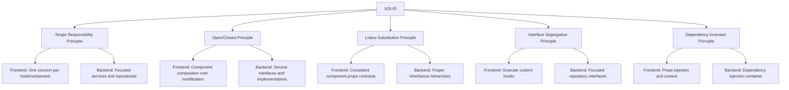
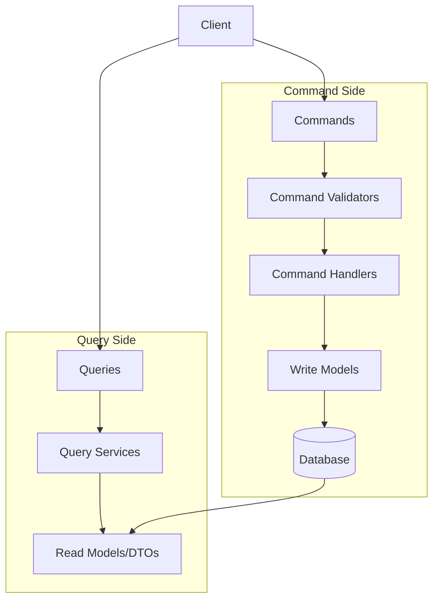
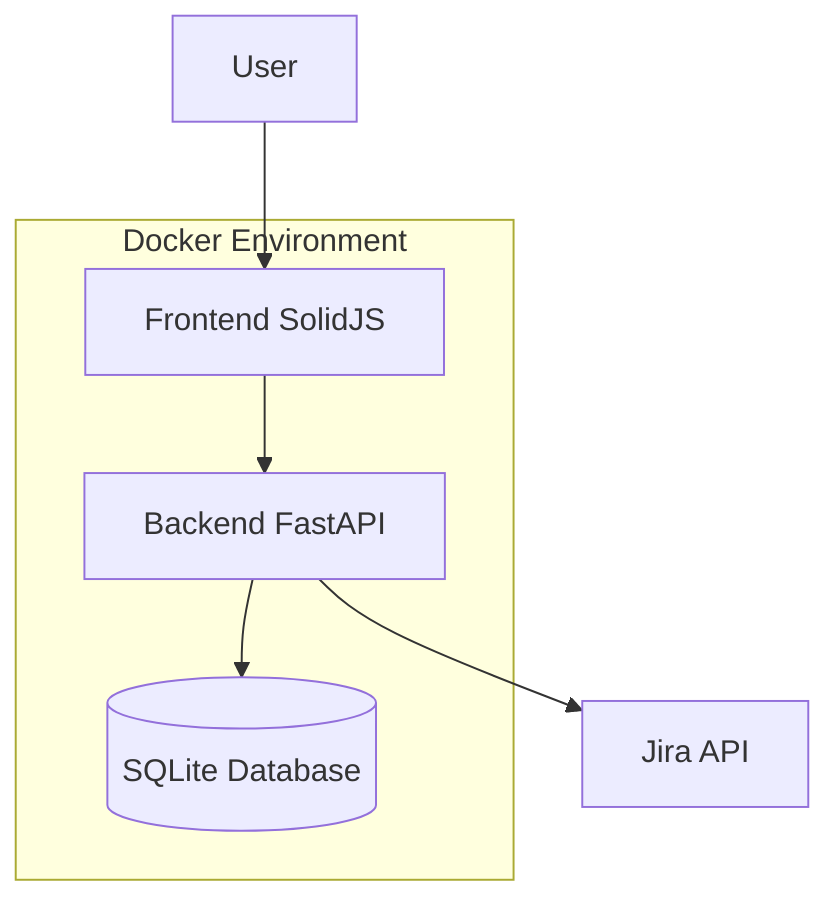
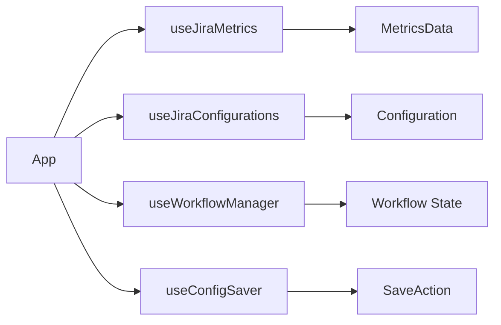
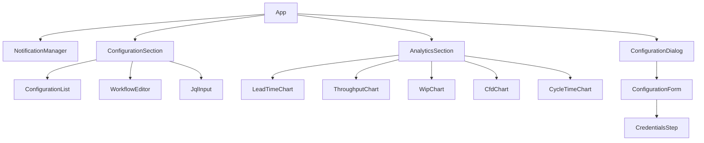
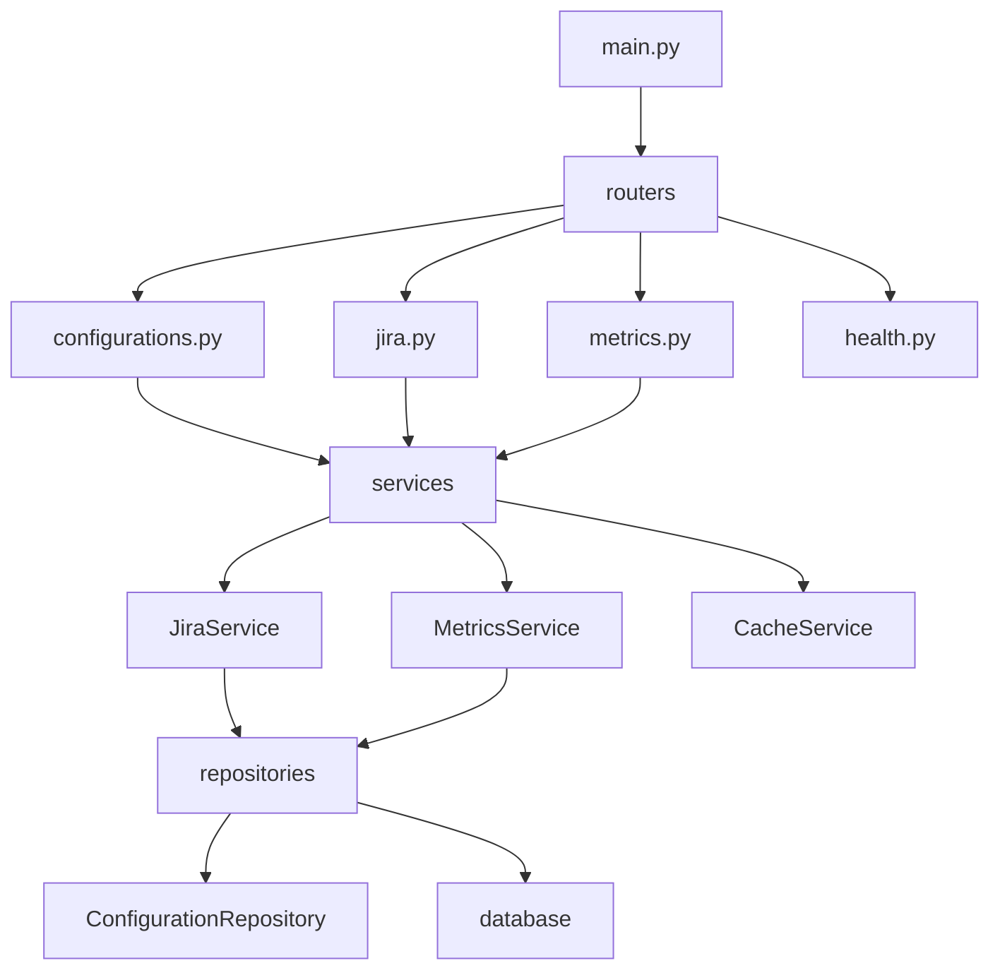

# Jira Analyzer System Patterns

> **Executive Summary:** Jira Analyzer follows a containerized microservices architecture with SolidJS frontend and FastAPI backend. It implements SOLID principles, CQRS pattern, and functional programming approaches to ensure maintainability and scalability. The system uses custom hooks for state management and dependency injection for service management.

<!--
Last Updated: 08/04/2025
Related Documents:
- [Memory Bank Index](./INDEX.md)
- [Project Brief](./projectbrief.md)
- [Product Context](./productContext.md)
- [Tech Context](./techContext.md)
- [Active Context](./activeContext.md)
- [Progress](./progress.md)
- [SOLID Principles](./patterns/solid.md)
- [CQRS Pattern](./patterns/cqrs.md)
- [Functional Programming](./patterns/functional-programming.md)
-->

## Table of Contents

- [SOLID Implementation Patterns](#solid-implementation-patterns-added)
- [CQRS Implementation](#cqrs-implementation-added)
- [System Architecture](#system-architecture)
- [Key Technical Decisions](#key-technical-decisions)
- [Design Patterns in Use](#design-patterns-in-use)
- [Component Relationships](#component-relationships)
- [Critical Implementation Paths](#critical-implementation-paths)

## SOLID Implementation Patterns (Added)

## CQRS Implementation (Added)

Command Query Responsibility Segregation (CQRS) pattern will be implemented to separate read and write operations:

### Command Side Implementation

- Command objects represent intent to change state
- Validation occurs before processing
- Command handlers contain business logic
- Write models focus on data consistency

### Query Side Implementation

- Query services optimize for read performance
- Read models/DTOs shaped for specific UI needs
- Potential for separate read stores or caching
- No side effects or state changes

## System Architecture

### Containerized Microservices Architecture

The Jira Analyzer follows a containerized architecture with two primary services:

1. **Frontend Service (SolidJS)**

   - Handles user interface and interactions
   - Manages state locally through reactive patterns
   - Communicates with backend via REST API calls

2. **Backend Service (FastAPI)**
   - Processes API requests
   - Interfaces with Jira API
   - Handles data storage and retrieval
   - Processes metrics calculations

### Data Flow Architecture

The system implements a unidirectional data flow pattern:

1. User interactions trigger state changes in UI components
2. State changes cause API requests to the backend
3. Backend processes requests and returns responses
4. Frontend updates its state based on responses
5. UI re-renders reactively based on state changes

## Key Technical Decisions

### 1. SolidJS for Frontend

**Decision**: Use SolidJS rather than React or Vue

- **Rationale**:
  - True reactivity without Virtual DOM overhead
  - Better performance for data-intensive visualizations
  - Lower memory footprint for chart rendering
  - Component model with familiar JSX syntax

### 2. FastAPI for Backend

**Decision**: Use FastAPI rather than Flask or Django

- **Rationale**:
  - High-performance async capabilities
  - Built-in OpenAPI documentation
  - Type safety through Pydantic
  - Simplicity and developer productivity

### 3. Local Hook-based State Management

**Decision**: Use custom hooks rather than global state management

- **Rationale**:
  - Better encapsulation of related functionality
  - Reduced complexity compared to global stores
  - More explicit data flow within component hierarchies
  - Better testability of isolated units

### 4. Docker-based Development and Deployment

**Decision**: Use Docker for both development and production

- **Rationale**:
  - Consistent environments across development and production
  - Simplified onboarding for new developers
  - Isolation of dependencies and services
  - Scalable deployment options

## Design Patterns in Use

### 1. Custom Hooks Pattern (Frontend)

Custom hooks encapsulate related functionality and state management:

- `useJiraMetrics` - Manages metrics data fetching and processing
- `useJiraConfigurations` - Handles configuration management
- `useWorkflowManager` - Controls workflow state editing
- `useConfigSaver` - Manages configuration saving logic

### 2. Higher-Order Component Pattern (Frontend)

The `withChart` HOC wraps chart components to provide common functionality:

- Consistent loading states
- Error handling
- Empty data handling
- Responsive resizing

### 3. Dependency Injection Pattern (Backend)

Backend uses DI for service management:

- Services are registered in a container
- Dependencies are resolved at runtime
- Facilitates testing through mock injection
- Maintains separation of concerns

### 4. Repository Pattern (Backend)

Data access is abstracted through repositories:

- `ConfigurationRepository` handles configuration storage
- Direct database operations are isolated
- Business logic remains separate from data access

### 5. Service Layer Pattern (Backend)

Business logic is encapsulated in service classes:

- `JiraService` handles Jira API interactions
- `MetricsService` calculates workflow metrics
- Services depend on repositories for data access
- Clear separation of concerns

## Component Relationships

### Frontend Component Hierarchy

### Backend Module Relationships

## Critical Implementation Paths

### 1. Configuration Creation Flow

1. User enters configuration details in `ConfigurationForm`
2. `useFormSubmission` validates and prepares data
3. `jiraApi.createConfiguration` sends request to backend
4. Backend `configurations.router` handles request
5. `ConfigurationService` processes and stores configuration
6. Response returns to frontend
7. `useJiraConfigurations` updates configuration list

### 2. Metrics Analysis Flow

1. User selects configuration and clicks Analyze
2. `handleAnalyze` function triggers in App component
3. `useJiraMetrics.fetchMetrics` calls backend API
4. Backend routes request to metrics endpoints
5. `MetricsService` calls Jira API via `JiraService`
6. Backend processes raw data into metrics
7. Frontend receives metrics data
8. Chart components render visualizations

### 3. Workflow Management Flow

1. User edits workflow in `WorkflowEditor`
2. `useWorkflowManager` updates workflow state
3. `useConfigSaver` prepares updated configuration
4. Configuration is saved via API
5. Backend validates and stores updated workflow
6. Updated workflow affects metric calculations

### 4. Error Handling Path

1. API calls wrapped in try/catch blocks
2. Errors propagated to `NotificationManager`
3. User notified of issues via toast notifications
4. Error states reflected in UI components
5. Backend provides detailed error responses
6. Rate limiting prevents API abuse
