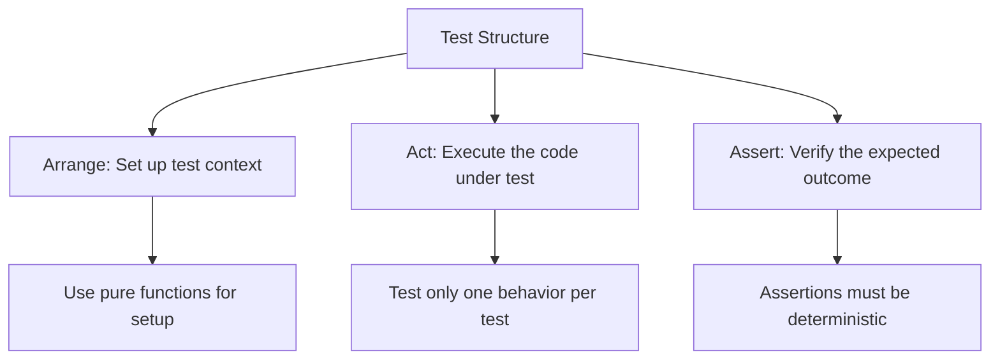

# Jira Analyzer Technical Context

> **Executive Summary:** Jira Analyzer uses SolidJS and TypeScript for the frontend with TailwindCSS for styling, and Python 3.11+ with FastAPI for the backend. The project is containerized with Docker, uses GitHub Actions for CI/CD, and follows strict testing standards including FIRST principles. Development requires Docker, Git, and a Jira instance for testing.

<!--
Last Updated: 08/04/2025
Related Documents:
- [Memory Bank Index](./INDEX.md)
- [Project Brief](./projectbrief.md)
- [Product Context](./productContext.md)
- [System Patterns](./systemPatterns.md)
- [Active Context](./activeContext.md)
- [Progress](./progress.md)
- [Unit Testing](./testing/unit-testing.md)
- [SOLID Principles](./patterns/solid.md)
- [CQRS Pattern](./patterns/cqrs.md)
- [Functional Programming](./patterns/functional-programming.md)
-->

## Table of Contents

- [Technologies Used](#technologies-used)
  - [Frontend Stack](#frontend-stack)
  - [Backend Stack](#backend-stack)
  - [Infrastructure & DevOps](#infrastructure--devops)
- [Development Setup](#development-setup)
  - [Local Development Environment](#local-development-environment)
- [Technical Constraints](#technical-constraints)
  - [Performance Considerations](#performance-considerations)
- [Dependencies](#dependencies)
  - [External Dependencies](#external-dependencies)
  - [Internal Dependencies](#internal-dependencies)
- [Tool Usage Patterns](#tool-usage-patterns)
  - [Development Tools](#development-tools)
  - [Testing Approaches](#testing-approaches)
- [Testing Standards](#testing-standards-added)

## Technologies Used

### Frontend Stack

- **SolidJS**: Core UI framework providing reactive rendering without Virtual DOM
- **TypeScript**: Strongly typed JavaScript superset for improved code quality
- **TailwindCSS**: Utility-first CSS framework for styling
- **Vite**: Fast build tool and development server
- **Vitest**: Testing framework for SolidJS components
- **Axios**: HTTP client for API communication
- **solid-dnd**: Drag-and-drop functionality for workflow editor
- **D3.js**: Data visualization library for custom charts

### Backend Stack

- **Python 3.11+**: Core language for backend services
- **FastAPI**: Modern, high-performance web framework
- **SQLAlchemy**: ORM for database interactions with async support
- **Pydantic**: Data validation and settings management
- **Alembic**: Database migration tool
- **Uvicorn**: ASGI server for FastAPI applications
- **AsyncIO**: Asynchronous I/O for non-blocking operations

### Infrastructure & DevOps

- **Docker**: Containerization of applications
- **Docker Compose**: Multi-container orchestration
- **GitHub Actions**: CI/CD pipeline automation
- **Playwright**: End-to-end testing framework
- **Ruff**: Python linter for code quality
- **ESLint**: JavaScript/TypeScript linter
- **Pre-commit**: Git hooks for code quality checks
- **Mise**: Tool version management

## Development Setup

### Local Development Environment

1. **Prerequisites**:

   - Docker and Docker Compose
   - Git
   - Jira instance for testing (or mock mode)

2. **Repository Structure**:

   - `/frontend`: SolidJS frontend application
   - `/backend`: FastAPI backend application
   - `/e2e-tests`: Playwright end-to-end tests
   - `/memory-bank`: Project documentation and context

3. **Development Workflow**:

   - Environment variables configured via `.env` file based on `.env.example`
   - Development mode: `docker-compose -f docker-compose.dev.yml up -d`
   - Production mode: `docker-compose up -d`
   - Testing: `make test` (unit tests) or `make e2e-tests` (end-to-end)
   - Code formatting enforced via pre-commit hooks

4. **Debug Capabilities**:
   - Frontend debugging via browser devtools (port 3000)
   - Backend debugging via debugpy (port 5678)
   - End-to-end visual debugging with Playwright in headed mode

## Technical Constraints

### Performance Considerations

- **Data Processing Limitations**:

  - Jira API rate limiting must be respected
  - Large datasets may require pagination and optimized processing
  - Chart rendering performance critical for large datasets

- **Security Requirements**:

  - Jira credentials must be securely stored
  - No sensitive data in logs or error messages
  - API requests validated to prevent injection attacks

- **Compatibility Constraints**:

  - Must support both Jira Cloud and Jira Server instances
  - Browser compatibility with modern evergreen browsers
  - Responsive design for various screen sizes

- **Deployment Limitations**:
  - Docker-based deployment requires container orchestration
  - Database persistence needs volume mounting
  - Environment-specific configuration via environment variables

## Dependencies

### External Dependencies

- **Jira REST API**: Core external dependency for all metrics

  - Requires proper authentication
  - Version-specific endpoints and responses
  - Rate limits and throttling considerations

- **Browser APIs**:
  - LocalStorage for maintaining session state
  - Fetch API or alternatives for AJAX requests
  - Canvas/SVG for chart rendering

### Internal Dependencies

- **Frontend Dependencies**:

  - Component relationships managed through props drilling
  - State managed through custom hooks
  - React-style JSX for component templating
  - Chart abstractions through HOC pattern

- **Backend Dependencies**:
  - Dependency injection container for service management
  - Repository pattern for data access abstraction
  - Router modules for API endpoint organization
  - Middleware for cross-cutting concerns

## Tool Usage Patterns

### Development Tools

- **Make**: Task automation through Makefile targets

  - Building containers
  - Running tests
  - Database migrations
  - Linting and formatting

- **Docker Compose**: Environment management

  - Development vs. production environments
  - Service coordination and networking
  - Volume mounting for persistence
  - Environment variable injection

- **Version Control**:
  - Feature branch workflow
  - Pull request reviews
  - Pre-commit hooks for quality enforcement
  - GitHub-based CI/CD integration

### Testing Approaches

- **Unit Testing**:

  - Component tests with mocked dependencies
  - Service tests with mocked external APIs
  - Hook tests with controlled inputs/outputs

- **Integration Testing**:

  - API endpoint testing with test database
  - Frontend/backend integration verification
  - Chart rendering with test data

- **End-to-end Testing**:
  - User journey simulations with Playwright
  - Visual regression testing
  - Performance testing guidelines

## Testing Standards (Added)

All new code must adhere to these testing standards:

### FIRST Principles

- **Fast**: Tests should run quickly to enable frequent execution
- **Independent**: Tests should not depend on each other
- **Repeatable**: Tests should yield the same results regardless of environment
- **Self-validating**: Tests should automatically determine if they pass or fail
- **Timely**: Tests should be written at the same time as the code

### Functional Decomposition in Tests

### Test Coverage Requirements

- **Line Coverage**: Minimum 90% for new code
- **Branch Coverage**: All conditional branches must be tested
- **Mutation Testing**: Critical paths must pass mutation tests
- **Contract Testing**: API boundaries must have contract tests

### Testing Anti-patterns to Avoid

- **Flaky Tests**: Tests that sometimes pass and sometimes fail
- **Overlapping Tests**: Multiple tests verifying the same behavior
- **Slow Tests**: Tests that take too long to run
- **Brittle Tests**: Tests that break with minor implementation changes
- **Test Duplication**: Copy-pasted test code without abstraction
