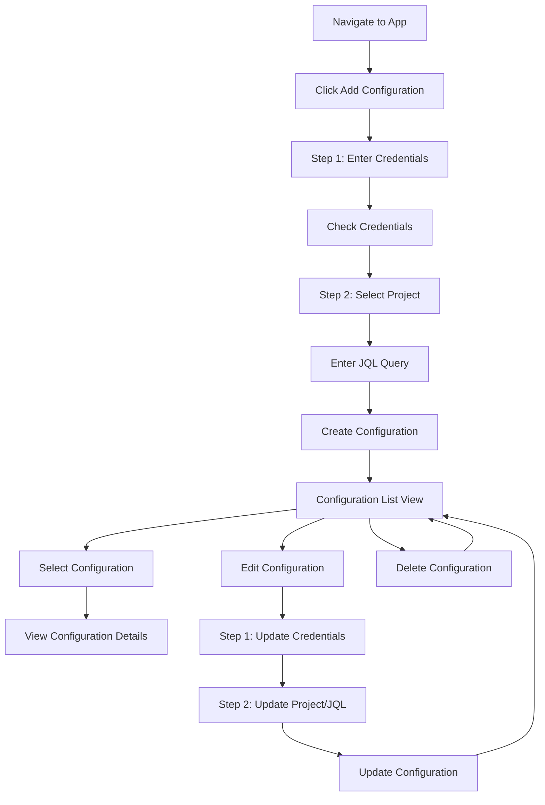
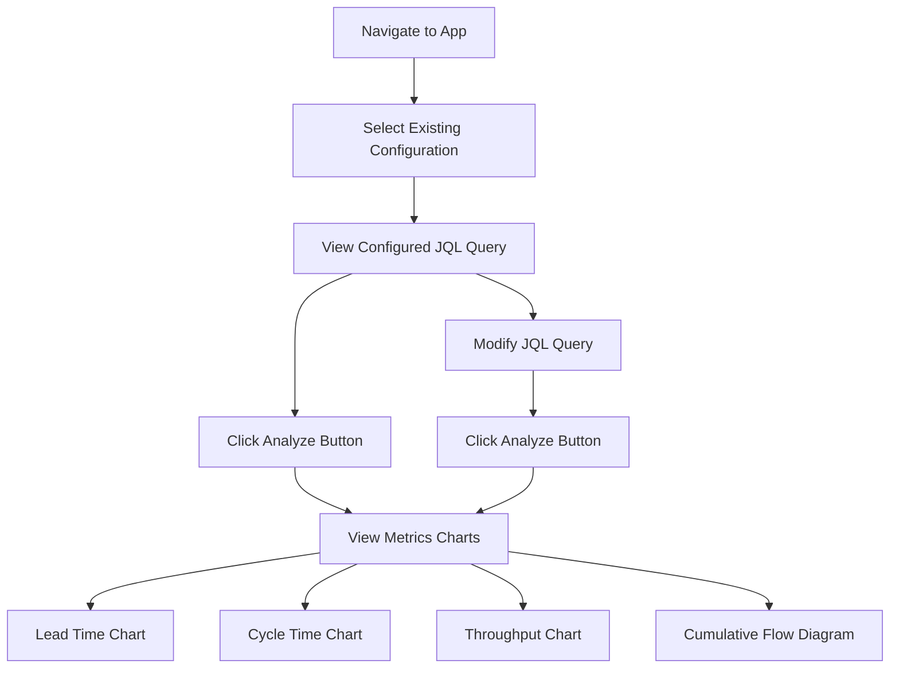
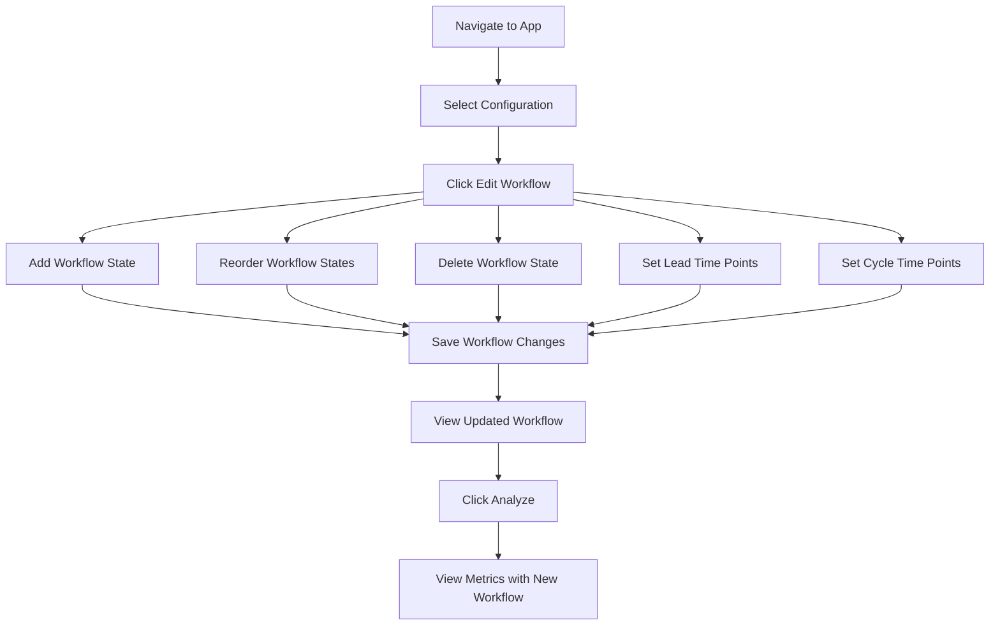

# User Journeys for E2E Testing

> **Executive Summary:** This document outlines the primary user journeys in the Jira Analyzer application, providing visual flow diagrams to guide end-to-end test development and maintenance. These journeys represent the core user interactions that must be tested to ensure application functionality.

## Table of Contents

- [Configuration Management Journey](#configuration-management-journey)
- [Metrics Analysis Journey](#metrics-analysis-journey)
- [Workflow Management Journey](#workflow-management-journey)
- [Test State Management](#test-state-management)

## Configuration Management Journey

This journey covers the creation, selection, editing, and deletion of Jira configurations.

### Key Testing Points

1. **Configuration Creation**

   - All fields in the multi-step form must be validated
   - Credentials must be checked before proceeding
   - Project selection and JQL query must be validated
   - Configuration name must be unique

2. **Configuration Selection**

   - Selecting a configuration should load its details
   - The selected configuration should be visually indicated

3. **Configuration Editing**

   - All fields should be pre-filled with existing values
   - Changes should be properly saved
   - Validation should occur at each step

4. **Configuration Deletion**
   - Confirmation should be required
   - Configuration should be removed from the list
   - Related data should be cleaned up

## Metrics Analysis Journey

This journey covers the analysis of Jira metrics using a configuration.

### Key Testing Points

1. **Configuration Selection**

   - A configuration must be selected before analysis
   - The JQL query should be displayed and editable

2. **Analysis Execution**

   - The Analyze button should trigger data fetching
   - Loading states should be properly displayed
   - Error states should be handled gracefully

3. **Chart Rendering**

   - All charts should render correctly
   - Empty data states should be handled gracefully
   - Chart interactions should work as expected

4. **JQL Modification**
   - JQL query should be editable
   - Modified queries should produce updated charts

## Workflow Management Journey

This journey covers the management of workflow states within a configuration.

### Key Testing Points

1. **Workflow Editor Access**

   - The workflow editor should be accessible from the configuration view
   - Current workflow states should be pre-loaded

2. **State Management**

   - Adding states should update the workflow list
   - Reordering states should work via drag and drop
   - Deleting states should remove them from the workflow

3. **Time Point Configuration**

   - Lead time start/end points should be selectable
   - Cycle time start/end points should be selectable
   - Invalid selections should be prevented

4. **Workflow Saving**
   - Changes should be properly saved
   - The updated workflow should be reflected in the UI
   - Metrics should use the updated workflow definitions

## Test State Management

To effectively test these journeys, tests must be able to:

1. **Ensure Correct Application State**

   - Navigate to the correct view
   - Create or select configurations as needed
   - Set up workflow states as required

2. **Verify State Transitions**

   - Confirm navigation between views works correctly
   - Verify data persistence between steps
   - Ensure UI updates reflect backend changes

3. **Handle Different UI Contexts**
   - Recognize when elements are in different contexts
   - Adapt selectors based on the current view
   - Navigate to the appropriate context when needed

The test utilities should provide functions to ensure the application is in the correct state for each test, following these user journeys.
